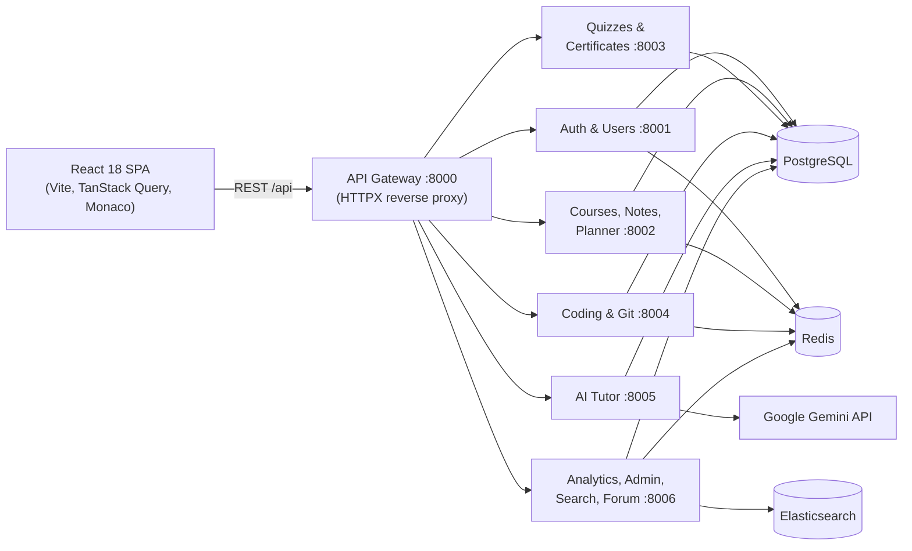

# Codexia Academy — AI-Powered Learning Management System

A full-stack learning platform that combines video courses, an AI tutor, a multi-language coding practice environment, Git-style versioned notes, verifiable certificates, and paid courses — built with **FastAPI**, **React**, **PostgreSQL**, and the **Google Gemini API**.

**[Live Demo](https://codexia-acadamy.vercel.app)** · **[API Docs](https://codexia-backend-wrvr.onrender.com/api/docs)** · **[Report an Issue](https://github.com/parmarramnik/Codexia-Acadamy/issues)**

[](https://www.python.org/)
[](https://fastapi.tiangolo.com/)
[](https://react.dev/)
[](https://www.postgresql.org/)
[](https://redis.io/)
[](https://www.elastic.co/)
[](https://ai.google.dev/)
[](https://www.docker.com/)
[](https://razorpay.com/)

> The backend runs on Render's free tier, so the first request after a period of inactivity may take a little while to respond.

---

## Table of Contents

- [Overview](#overview)
- [Features](#features)
- [Architecture](#architecture)
- [Tech Stack](#tech-stack)
- [Project Structure](#project-structure)
- [Getting Started](#getting-started)
- [Environment Variables](#environment-variables)
- [Payments Setup (Razorpay)](#payments-setup-razorpay)
- [Deployment](#deployment)
- [Testing](#testing)
- [Security](#security)
- [License](#license)

---

## Overview

Most learning platforms stop at video playback. Codexia Academy also gives students somewhere to practise and get help:

- An **AI tutor** answers questions using the content of the course being studied.
- A **coding environment** runs solutions against test cases in six languages.
- **Lecture notes with Git-style version control** support branches, diffs, and merges.
- **Tamper-evident certificates** can be verified publicly by anyone.

There are separate experiences for **students**, **instructors**, **admins**, and **super admins**, with 33 pages in the React frontend.

---

## Features

### AI learning assistant (Google Gemini 2.5 Flash)

- **Course-aware AI tutor** — multi-turn chat that keeps the last 10 messages as context. It grounds answers in course material through a retrieval-augmented generation (RAG) step: content is chunked, embedded with Sentence-Transformers, and searched with a FAISS index.
- **Content generation** — AI-generated notes, flashcards, and quizzes from course material.
- **AI code review** — time and space complexity (Big-O), likely bugs, and improvement suggestions for submitted code.
- **Study planner** — personalised weekly study plans, plus course recommendations.
- **AI commit messages** — summaries generated from note diffs.

### Coding practice

- **Monaco Editor** (the editor behind VS Code) with syntax highlighting.
- **Six languages** — Python, JavaScript, C, C++, Java, and Go.
- **Test runner** — runs code against sample and hidden test cases or custom input, with compile/run time limits, and reports pass/fail and runtime.
- **Problem hub** — LeetCode-style problems filterable by difficulty and topic, instructor-authored problems, daily challenges, and leaderboards.

### Git-style version control for notes

- Commits, branches, checkout, tags, cherry-pick, and restore-to-commit for Markdown lecture notes.
- **3-way merge** that finds the merge base with a lowest-common-ancestor (LCA) search over the commit graph and merges line by line, with conflict detection and resolution strategies (`keep_target`, `keep_source`, `merge_both`, `custom`).
- Side-by-side and word-level diffs, a visual commit timeline, and export to PDF, Markdown, or JSON.

### Courses, quizzes and certificates

- Course catalogue with modules, lectures, enrollments, and progress tracking; instructors build courses in a course builder.
- Quizzes with automatic grading.
- **PDF certificates** generated with ReportLab, each with a QR code and an unguessable credential ID (e.g. `CDX-2026-7KQ2-M9XA`).
- Certificates are signed with **HMAC-SHA256**, so an edited record fails verification on the public `/verify` page. No login is needed to verify.

### Paid courses (Razorpay)

- Courses are free or paid. Prices are stored in paise and set by admins; instructors submit price requests for approval.
- **Server-verified checkout** — the backend takes the price from the database, creates the Razorpay order, verifies the payment signature, confirms capture, and grants enrollment exactly once.
- **Signed, idempotent webhooks** and automatic reconciliation handle closed tabs, lost callbacks, and out-of-order events.
- Paid lecture videos stream only through short-lived signed URLs that re-check access on each request.
- Admin payments ledger with filters, search, refunds, and one-click reconciliation.

### Analytics, community and administration

- Study heatmaps, streaks, skill radar charts (Recharts), and leaderboards.
- Discussion forum with threaded replies, direct messages, and notifications.
- Admin portal with system health (CPU, memory, disk via `psutil`), audit logs, user and course management, and CSV report exports.

### Authentication and access control

- JWT access tokens (15 minutes) and refresh tokens, with a session list and remote sign-out.
- bcrypt password hashing, email OTP verification, and password reset.
- **Role-based access control (RBAC)** with four roles and database-stored role permissions.

---

## Architecture

The backend is a single FastAPI codebase that can run in two ways:

| Mode | Entry point | Used for |
| :--- | :--- | :--- |
| **Monolith** | `backend/main.py` — one FastAPI app serving every route | Production on Render, and local development |
| **Microservices** | `docker-compose.yml` — an API gateway plus six services | Running and scaling services separately |



In microservices mode, the gateway routes each request by its path prefix (for example `/api/auth` → Auth service). All services share one database and the same models.

> **Note:** Payments and pricing (`/api/payments`, `/api/pricing`) are mounted only in the monolith. Use monolith mode to test checkout.

**Graceful fallbacks.** The app keeps working when optional infrastructure is missing:

| If this is unavailable… | …the app falls back to |
| :--- | :--- |
| Redis | An in-memory TTL cache |
| Elasticsearch | PostgreSQL `ILIKE` search |
| Sentence-Transformers / FAISS | The first chunks of course content as AI tutor context |
| `GEMINI_API_KEY` | AI features return a clear "not configured" message |
| PostgreSQL (local dev) | SQLite (`DATABASE_URL` defaults to `sqlite:///./ai_lms.db`) |

---

## Tech Stack

| Layer | Technologies |
| :--- | :--- |
| **Frontend** | React 18, Vite, React Router 6, TanStack Query, Axios, Monaco Editor, Recharts, React Markdown |
| **Backend** | Python 3.11, FastAPI, Uvicorn, SQLAlchemy 2.0, Pydantic v2, HTTPX, SlowAPI |
| **AI** | Google Gemini API (`gemini-2.5-flash`), Sentence-Transformers, FAISS |
| **Data** | PostgreSQL 15 (SQLite for local dev), Redis 7, Elasticsearch 8 |
| **Auth & security** | JWT (python-jose), bcrypt (passlib), RBAC, HMAC-SHA256 signing |
| **Payments** | Razorpay Orders API, checkout and webhooks |
| **Documents & email** | ReportLab (PDF), qrcode, Brevo HTTP API or SMTP |
| **DevOps** | Docker, Docker Compose, Nginx, GitHub Actions, Render, Vercel |
| **Testing** | Pytest |

---

## Project Structure

```text
.
├── backend/
│   ├── main.py                 # Monolith entry point (all routers)
│   ├── config.py               # Settings loaded from .env
│   ├── database.py             # SQLAlchemy engine, sessions, table creation
│   ├── ai/                     # Gemini tutor, content generators, code helper, embeddings/FAISS
│   ├── auth/                   # JWT handling, password hashing, OAuth2, RBAC permissions
│   ├── middleware/             # CORS, rate limiting, security headers, error handlers
│   ├── microservices/          # API gateway + auth, course, quiz, coding, ai, analytics services
│   ├── models/                 # SQLAlchemy models
│   ├── prompts/                # LLM prompt templates
│   ├── routes/                 # FastAPI routers
│   ├── schemas/                # Pydantic request/response schemas
│   ├── services/               # Business logic (payments, git, coding, search, …)
│   ├── utils/                  # Cache, Elasticsearch client, PDF, email, signed media links
│   ├── tests/                  # Pytest suite
│   ├── seed_db.py              # Seeds users, courses, quizzes
│   └── seed_coding_problems.py # Seeds coding problems
├── frontend/
│   ├── src/
│   │   ├── components/         # Layout, common UI, admin, payments, coding, certificates
│   │   ├── context/            # Auth and theme providers
│   │   ├── hooks/              # Shared hooks (e.g. course purchase flow)
│   │   ├── pages/              # 33 route-level pages
│   │   ├── services/           # Axios API clients
│   │   └── utils/              # Money formatting, Razorpay checkout loader
│   ├── nginx.conf              # Production static server + API proxy (Docker)
│   └── vite.config.js          # Dev server on :3000, proxies /api to :8000
├── .github/workflows/ci.yml    # GitHub Actions CI
├── docker-compose.yml          # Microservices stack (dev)
├── docker-compose.prod.yml     # Microservices stack (production)
├── Dockerfile                  # Monolith backend image
└── .env.example                # Environment variable template
```

---

## Getting Started

### Prerequisites

- **Python 3.10+** and **Node.js 18+**
- A **Google Gemini API key** from [Google AI Studio](https://aistudio.google.com/) (optional — only the AI features need it)
- **Docker Desktop** (only for Option B)

### Option A — Run locally (recommended for development)

This uses SQLite, so you don't need PostgreSQL, Redis, or Elasticsearch.

#### 1. Clone and configure

```bash
git clone https://github.com/parmarramnik/Codexia-Acadamy.git
cd Codexia-Acadamy
cp .env.example .env
```

In `.env`, set at least:

```env
JWT_SECRET_KEY=<a long random string>
GEMINI_API_KEY=<your Gemini API key>
```

To use SQLite, remove or comment out the `DATABASE_URL` line.

#### 2. Start the backend

```bash
cd backend
python -m venv venv
# Windows
venv\Scripts\activate
# macOS / Linux
source venv/bin/activate

pip install -r requirements.txt
python seed_db.py
python seed_coding_problems.py
uvicorn main:app --reload --port 8000
```

API docs: <http://localhost:8000/api/docs>

> **Optional — semantic search for the AI tutor:** `pip install sentence-transformers faiss-cpu`. Without these, the tutor uses the first chunks of course content as context.

#### 3. Start the frontend (in a new terminal)

```bash
cd frontend
npm install
npm run dev
```

Open <http://localhost:3000>. The Vite dev server proxies `/api` to the backend on port 8000.

### Option B — Docker Compose (microservices)

```bash
cp .env.example .env      # set JWT_SECRET_KEY, POSTGRES_PASSWORD, GEMINI_API_KEY
docker compose up --build
```

This starts PostgreSQL, Redis, Elasticsearch, the six services, the API gateway, and the frontend.

| Service | URL |
| :--- | :--- |
| Frontend | <http://localhost:3000> |
| API gateway + docs | <http://localhost:8000/api/docs> |
| Services | `localhost:8001` – `localhost:8006` |

---

## Environment Variables

Copy `.env.example` to `.env`. The backend reads `.env` from the project root or from `backend/`.

| Variable | Required | Description |
| :--- | :---: | :--- |
| `JWT_SECRET_KEY` | ✅ | Signs JWTs and lecture stream links. Use a long random string. |
| `DATABASE_URL` | | Database connection string. Defaults to SQLite; use `postgresql://…` in production. |
| `DEBUG` | | `False` in production |
| `FRONTEND_URL` | Prod | Public frontend URL, used in email links and certificate QR codes |
| `CORS_ORIGINS` | Prod | Comma-separated list of allowed frontend origins |
| `GEMINI_API_KEY` | AI | Google Gemini API key |
| `GEMINI_MODEL` | | Defaults to `gemini-2.5-flash` |
| `REDIS_URL` | | Redis connection string (falls back to an in-memory cache) |
| `ELASTICSEARCH_URL` | | Elasticsearch URL (falls back to database search) |
| `BREVO_API_KEY` | Email | Brevo HTTP API key for production email (recommended on Render) |
| `SMTP_HOST`, `SMTP_PORT`, `SMTP_USER`, `SMTP_PASSWORD` | Email | SMTP alternative for local development |
| `CERTIFICATE_SIGNING_KEY` | | Signs certificates (falls back to `JWT_SECRET_KEY`). Keep it stable — changing it invalidates existing certificates. |
| `RAZORPAY_KEY_ID` | Payments | Razorpay key ID — the only Razorpay value sent to the browser |
| `RAZORPAY_KEY_SECRET` | Payments | Razorpay key secret — **backend only** |
| `RAZORPAY_WEBHOOK_SECRET` | Payments | The secret you set on the Razorpay webhook — **backend only** |

Frontend (`frontend/.env`): `VITE_API_URL` — the backend API URL, for example `https://<your-backend>.onrender.com/api`. Every `VITE_*` value is public in the browser bundle, so never put secrets here.

---

## Payments Setup (Razorpay)

Start with **Test Mode** keys (`rzp_test_…`); no real money moves.

1. **Get API keys** — Razorpay Dashboard → Account & Settings → API Keys. Put `RAZORPAY_KEY_ID` and `RAZORPAY_KEY_SECRET` in your backend environment.
2. **Create a webhook** — Razorpay Dashboard → Settings → Webhooks → Add New Webhook:
   - **URL:** `https://<your-backend>.onrender.com/api/payments/razorpay/webhook`
   - **Secret:** a long random string, also set as `RAZORPAY_WEBHOOK_SECRET`
   - **Events:** `payment.authorized`, `payment.captured`, `payment.failed`, `order.paid`, `refund.created`, `refund.processed`, `refund.failed`
3. **Set prices** — Admin Panel → Course Pricing. Every course starts as free. The tables and pricing columns are created automatically on startup.
4. **Test** — run through: a successful payment, a failed payment, a cancelled checkout, a page refresh during payment, a duplicate webhook (Dashboard → Resend), an already-enrolled user, and an admin refund. In **Admin Panel → Payments**, check that each successful payment granted access exactly once.

Webhook deliveries in the Razorpay Dashboard should return **200**. A **401** means the webhook secret doesn't match; a **503** means `RAZORPAY_WEBHOOK_SECRET` isn't set on the server.

Switch to Live keys (`rzp_live_…`) and a Live Mode webhook only after the test checklist passes.

---

## Deployment

| Part | Platform | Notes |
| :--- | :--- | :--- |
| **Frontend** | Vercel | Root directory `frontend`, build `npm run build`, output `dist`. Set `VITE_API_URL`. `vercel.json` rewrites all routes to the SPA. |
| **Backend** | Render | Runs the monolith (`uvicorn main:app`) from the root `Dockerfile`. Set the variables above, with `DEBUG=False`, `FRONTEND_URL`, and your Vercel URL in `CORS_ORIGINS`. |
| **Database** | Any PostgreSQL host | Set `DATABASE_URL`. Tables are created on startup. |

---

## Testing

```bash
cd backend
pytest tests/
```

The suite covers authentication, courses, certificates, Git-style notes, admin routes, and payments. Payment tests include signature checks, webhook idempotency, refunds, and reconciliation.

GitHub Actions (`.github/workflows/ci.yml`) installs the dependencies and checks that the backend compiles on every push and pull request to `main`.

---

## Security

- **Payment amounts always come from the database.** The client sends only a course ID.
- **Razorpay signatures** are verified on checkout and on every webhook, using the raw request body.
- **Secrets stay on the server.** Only the Razorpay key ID reaches the browser.
- **Rate limiting** (SlowAPI), security headers, and input sanitisation run on every request.
- **Uploaded videos** aren't served publicly; they stream through signed, expiring, access-checked links. Externally hosted videos (YouTube, Drive, Vimeo) are only as private as their own sharing settings.
- **Code execution** runs each submission in a separate subprocess with time limits. For public, untrusted traffic, run the coding service in an isolated container or sandbox.

---

## License

Distributed under the MIT License. See [LICENSE](LICENSE) for details.

---

Built by [Ramnik Parmar](https://github.com/parmarramnik). If you find this project useful, consider giving it a ⭐.
